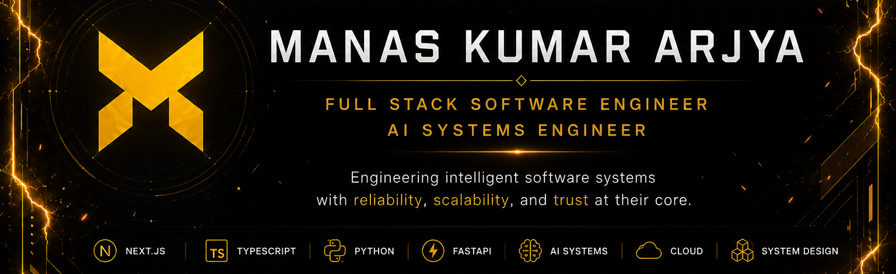

<!-- -------------------------------------------------------- -->
<!-- Optional Animated Banner (Uncomment to try) -->
<!-- Replace the static banner above with this if you prefer a subtle animated hero -->

  

 About

<h1 align="center">Hello World! 🌐 I'm Manas Kumar Arjya</h1>
<h3 align="center">Full Stack Software Engineer | AI Systems Engineer | Real-world Problem Solver</h3>
<h4 align="center">💡 I believe every great product starts with understanding the system before writing the code.</h4>
 

<!--
I'm a **Full Stack Software Engineer** building AI-powered applications, production-ready web platforms, and modern software architectures that solve meaningful real-world problems.
-->

---

##  Currently Focused on:

<h4 align="center">👩🏻‍💻 Engineering intelligent software systems with reliability, scalability, and trust at their core.</h4>

💻 Building: **AI-powered Products • Intelligent Software Systems • Production-ready applications**

🧠 Learning: **AI & ML Systems • Cloud Architecture • System Design • Distributed Systems**

🎯 Seeking: **Full-Time Software Engineering Opportunities**

💬 Open to discuss: **Software Engineering • AI • Full-Stack Development • System Design • Collaboration**

---

---

##  Featured Engineering Projects

> *The repositories below represent my most impactful work in AI, full-stack development, and software engineering.*

⬇️ **Explore my pinned repositories below.**
